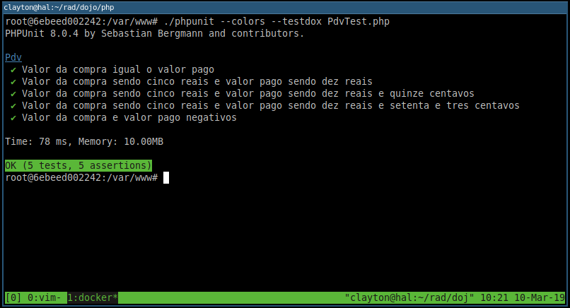

# Preparação do ambiente de testes

## Dependências

1. PHP 7
1. Docker
1. PHPUnit

## Inicialização do container de testes

```
$ docker run -it -v$(pwd):/var/www -w/var/www php:latest bash
```

Este comando irá inicializar um shell com a imagem `php:latest`,
baixando ela caso a mesma não esteja baixada.

## Instalação do PHPUnit

Estando dentro do container:

```
# curl -o phpunit -L https://phar.phpunit.de/phpunit-8.phar
# chmod +x phpunit
```

## Execução dos testes

```
# ./phpunit PdvTests.php
```

Execução dos testes com saída estilo `testdox`:

```
# ./phpunit --testdox PdvTests.php
```

<p align="center">
    
</p>

## Instalação em ambientes Windows

Para instalar em ambiente Windows, o processo é o mesmo, bastando instalar o Docker.

Para instalar no Windows 7 é necessário utilizar o *Docker Toolbox*.
